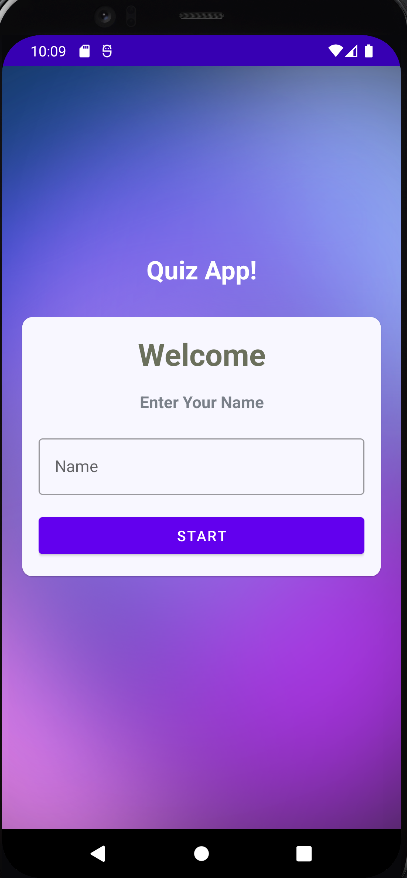
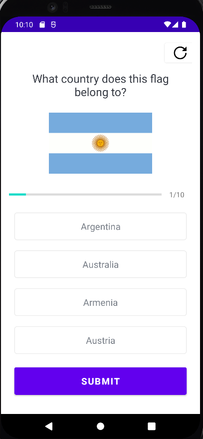
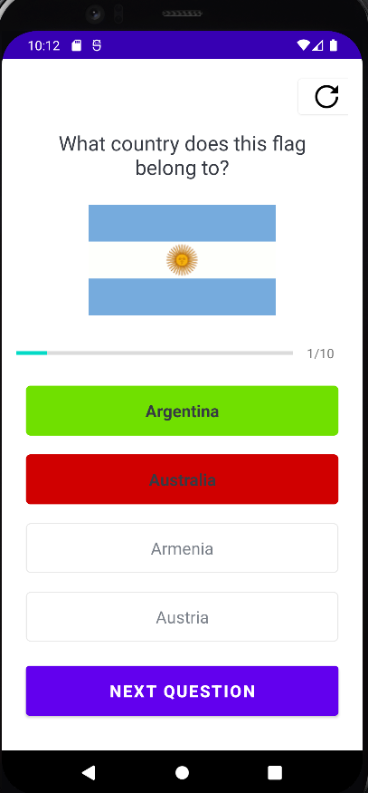
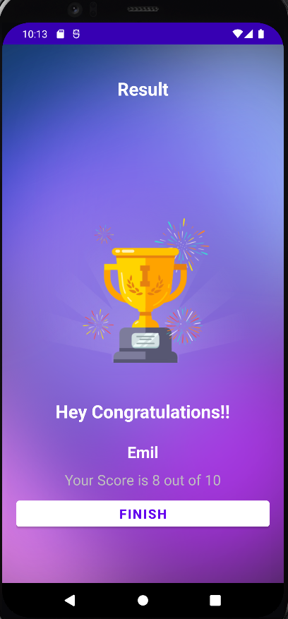

# Flag Quiz App

Welcome to the Flag Quiz App! This is an Android app built with Kotlin that tests your knowledge of countries by challenging you to guess their flags. The app presents you with various flag images, and you have to correctly identify the corresponding countries.

## Screenshots

  
  

## Features

- **Flag Display**: The app displays a random flag image from a collection of countries.
- **Multiple Choice**: You are provided with a set of multiple choice options to choose from for each flag.
- **Score Tracking**: The app keeps track of your score, incrementing it for each correct answer.

  
  

## Technologies Used

The Flag Quiz App is built using the following technologies:

- **Android Studio**: The official IDE for Android app development.
- **Kotlin**: The programming language used for developing Android apps.
- **XML**: Used for defining the layout and appearance of the app's user interface.

